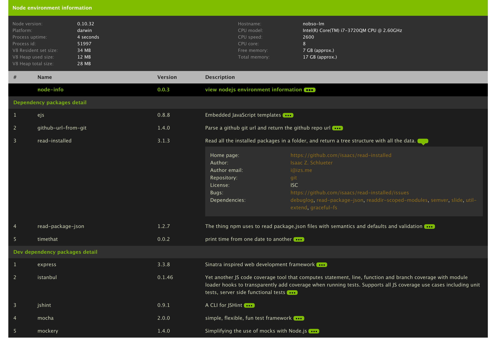

Node environment information [](https://travis-ci.org/yahoo/node-info)
===========================
It's a simple middleware which would give the node environment details as follow

   * basic node environment details such as node version, cpu, memory and platform 
   * all the installed node packages and their dependencies
   * shows dependencies and dev dependencies packages separately
   * additionally it gives a little more info about each package details like author, url etc.

Installation
--------------

`npm install node-info`

Usage 
-----------
Add the below lines in your express middleware to view the node env information.

```javascript
var nodeinfo = require('node-info');
app.use(nodeinfo());
```

Please check the [example code](example/node-info.js) 

Screenshot
--------------


This module is supported by the [ejs](https://github.com/visionmedia/ejs), [github-url-from-git](https://github.com/visionmedia/node-github-url-from-git), [read-installed](https://www.npmjs.org/package/read-installed), [timethat](https://github.com/davglass/timethat), [read-package-json](https://github.com/npm/read-package-json) and [node-github-url-from-git](https://github.com/visionmedia/node-github-url-from-git) node modules.
